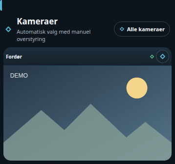

# HA Home Camera Card

## Neutral mobile preview



> Rendered at 390 px mobile width with fictional Home Assistant entities and values. No private dashboard, person, address, camera, or sensor data is included.


Et responsivt Home Assistant-kort, der samler flere automatiske kameragrupper i
ét `.js`-kort. Hver gruppe følger en valgsensor, kan overstyres lokalt og viser
aktivitet for person, dyr, køretøj, hændelse eller bevægelse. På både pc og
mobil står grupperne på én vandret række, og kameravalg åbnes i en kompakt menu
forankret ved den knap, der blev trykket på. Titel-linjen er som
standard skjult (`show_header: false`) og kan slås til i den visuelle editor
eller via config. Kameraerne vises uden `picture-glance`-kortets mørke
bundbjælke.

Selve kamerabilledet (ikke kun titel-linjen) kan trykkes for at navigere et
sted hen — sæt en global `navigation_path` for hele kortet, og/eller en
individuel `navigation_path` pr. kamera, som har forrang når den er sat.
Feedrammen håndhæves fysisk som 16:9 med klipning, så kameraer med et andet
kildeformat ikke kan gøre deres panel højere end de øvrige.
Kameraer kan desuden få individuel `fit_scale`; Fordør bruger som standard
`1.34`, så et 4:3-kildebillede fylder hele 16:9-rammen uden sorte sidefelter.
Ved indlæsning og kameraskift vises kameraets seneste snapshot med det samme.
Live-feedet startes bagved og fades først ind, når dets billedmedie er klar.
Kort og editor genbruger deres eksisterende DOM ved uændrede konfigurationer og
irrelevante HA-state-opdateringer, så hover, fokus og åbne felter ikke flimrer.
Klik på et feed kan konfigureres som navigation, mere-info eller ingen handling.
På brede dashboardlayouts kan `fill_height: true` få et kamera-grid til at
udfylde hele den tildelte kolonne med lige høje rækker.
Standardnavigationen er `/teknik-overblik/overvagning`, og kameravælgeren åbner
forankret direkte ved den knap, der blev trykket på.

```yaml
type: custom:ha-home-camera-card
title: Kameraer lige nu
navigation_path: /teknik-overblik/overvagning
click_action: navigate
show_header: false
groups:
  - name: Forside
    selector_entity: sensor.active_front_camera
    cameras:
      - key: front_door
        name: Fordør
        entity: camera.front_door
        navigation_path: /teknik-overblik/dore-og-vinduer
        detections:
          motion: binary_sensor.front_door_motion
```

Hvis `detections` udelades, finder kortet automatisk standardnavne ud fra
kameranøglen, fx `binary_sensor.front_door_person_detected`. Alle egne
tema-variable har fallback til Home Assistants standardvariabler og en normal
literal farve.

Kortet har en visuel editor til titel, navigationssti, grupper, valgsensorer,
kameraer og valgfrie bevægelsessensorer.

## Installation

Kopiér `ha-home-camera-card.js` til
`/config/www/ha-home-camera-card/ha-home-camera-card.js`, registrér den som en
module-resource, og tilføj `custom:ha-home-camera-card` i dashboardeditoren.

## Licens

MIT.
